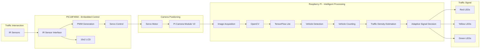

# 🚦 Smart Traffic Controller

### Intelligent Traffic Density Monitoring and Adaptive Signal Control using PIC18F4550, Raspberry Pi and Computer Vision

  <b>
    A hybrid embedded and computer-vision system for real-time vehicle detection,
    traffic-density estimation and adaptive traffic signal control.
  </b>

---

## 📌 Overview

Conventional traffic signal systems commonly operate using predefined timing cycles, regardless of the actual traffic present on individual roads. This can result in inefficient signal utilization and unnecessary vehicle waiting.

**Smart Traffic Controller** is an academic engineering prototype that demonstrates an adaptive traffic-management approach using **embedded systems, computer vision and machine learning**.

The system combines two computing layers:

- **PIC18F4550** — handles low-level embedded control, IR sensor interfacing, PWM generation and servo-based camera positioning.
- **Raspberry Pi** — performs camera acquisition, image processing, vehicle detection, vehicle counting and traffic-signal decision making.

A **Pi Camera Module V2** is mounted on a servo motor and positioned toward different road directions. The Raspberry Pi processes the captured frames using **OpenCV and a TensorFlow Lite object-detection model**.

Detected vehicles are counted and the vehicle count is used as an indicator of traffic density. The controller then selects a predefined green-light duration based on the detected traffic level.

The project demonstrates the integration of:

> **Embedded Systems + Sensors + PWM + Computer Vision + Machine Learning + Edge Computing + GPIO Control**

---

# 🎯 Objectives

- Detect vehicles from live camera frames.
- Estimate traffic density using detected vehicle count.
- Interface IR sensors with the PIC18F4550.
- Control a servo motor using PWM.
- Position a camera toward multiple road directions.
- Process camera frames using OpenCV.
- Perform lightweight object detection using TensorFlow Lite.
- Count detected vehicles.
- Determine adaptive green-light duration.
- Control traffic signal LEDs using Raspberry Pi GPIO.
- Demonstrate integration between an 8-bit microcontroller and edge-computing platform.

---

# 🏛️ System Architecture

